<p align="center">
  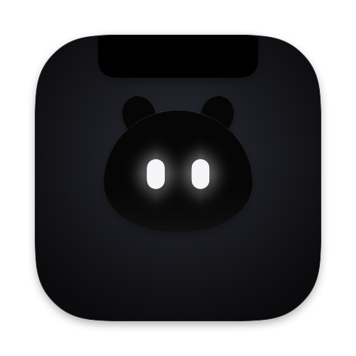
</p>

<h1 align="center">Peeku</h1>

<p align="center">
  <strong>A tiny companion that lives in your MacBook's notch and tells you when a Claude Code or Codex session needs you.</strong>
</p>

<p align="center">
  <a href="https://github.com/ahrefabhi/peeku/releases/latest"></a>
  
  
  <a href="LICENSE"></a>
</p>

<p align="center">
  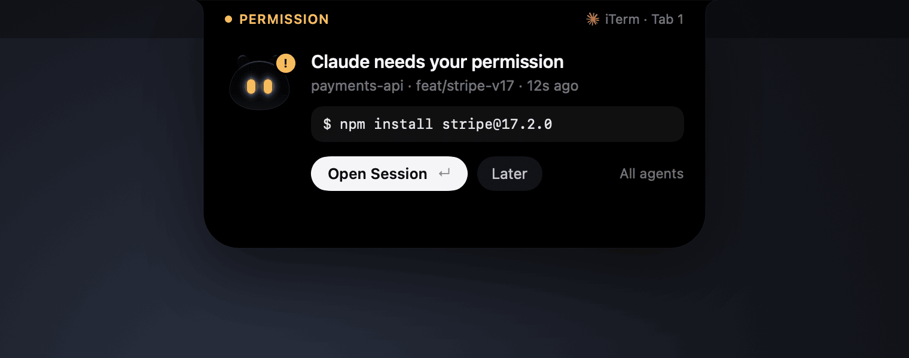
</p>

When a session stops to ask for permission, a question or help with an error, Peeku drops out of the notch and tells you why. **Open Session** takes you to the exact terminal tab or editor window.

https://github.com/user-attachments/assets/eefa5891-946c-46a3-9c4b-7ca000052e3b

## Features

- **Shows why a session is waiting:** the command, the question and its choices, the error, or the agent's last reply.
- **Opens the right place:** the exact iTerm or Terminal tab, or VS Code window. Other apps (Warp, Ghostty, Zed, Cursor…) come to the front too.
- **One queue, most urgent first:** permissions, then questions, then errors. Cycle with ⌥⌘↓.
- **Every session at a glance:** click the notch for what's waiting, working and finished, plus a week of history.
- **Rate limits:** your Claude and Codex 5-hour and weekly usage, with alerts at thresholds you set.
- **Spend:** what today, the last 7 or the last 30 days cost at API prices, tokens used, and bars split by model.
- **Quick commands:** save `npm run dev` with its folder, then run, restart and stop it from the notch. Read its output, answer its prompts, and hear about it when it fails.
- **Stays out of the way:** alerts fold into a pill, full screen shrinks Peeku to a glow, and it goes quiet while your screen is shared.
- **Read-only and private:** Peeku never types into or approves anything in your agent sessions, and everything stays on your Mac.
- **Native:** Swift and SwiftUI, light and dark mode, Reduce Motion, about 6 MB.

## A closer look

### In the notch

Idle, the notch is just the notch. While agents work, two eyes glance around. When something needs you, Peeku drops out.

<p align="center">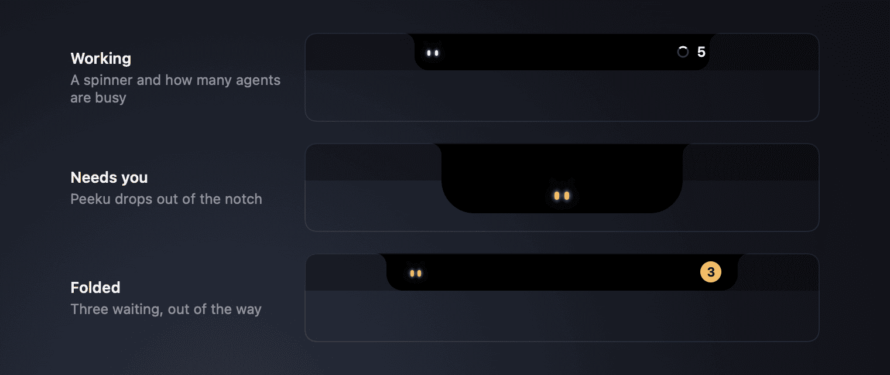</p>

### On a Mac without a notch

On an external display or older MacBook, there's no fake notch. Peeku lives in its menu bar icon, and the icon's eyes show what it's doing: they glance around while agents work, and change color with a dot or a count when something needs you. When an agent needs you, Peeku climbs down from the icon, hangs from the menu bar and holds the alert. Click the icon (or press ⌥⌘.) for the session manager, right-click it for the menu.

<p align="center">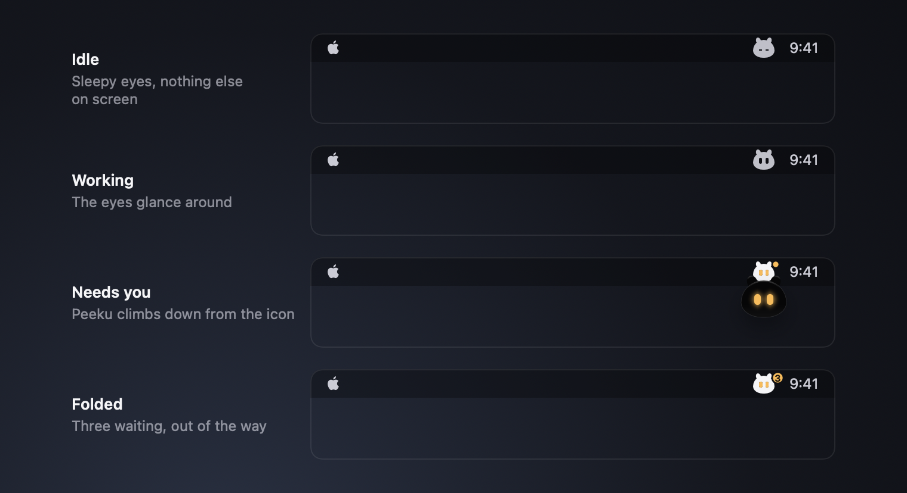</p>

<p align="center">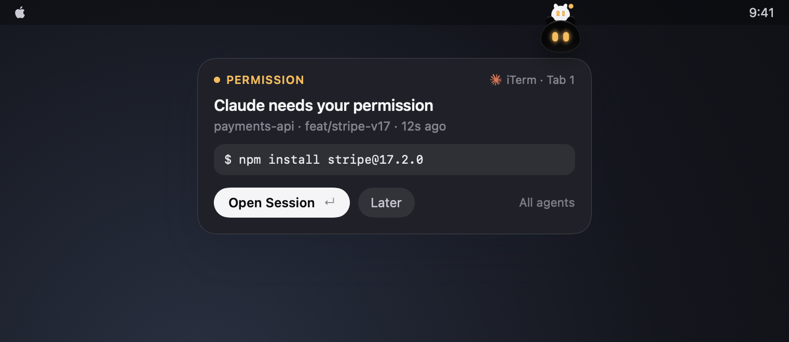</p>

### When several agents need you

<p align="center">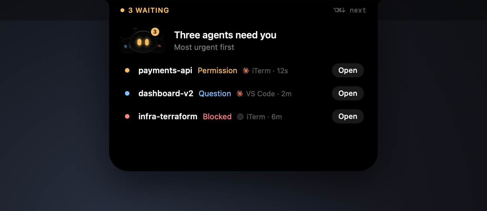</p>

### Every session, and what happened today

<p align="center">
  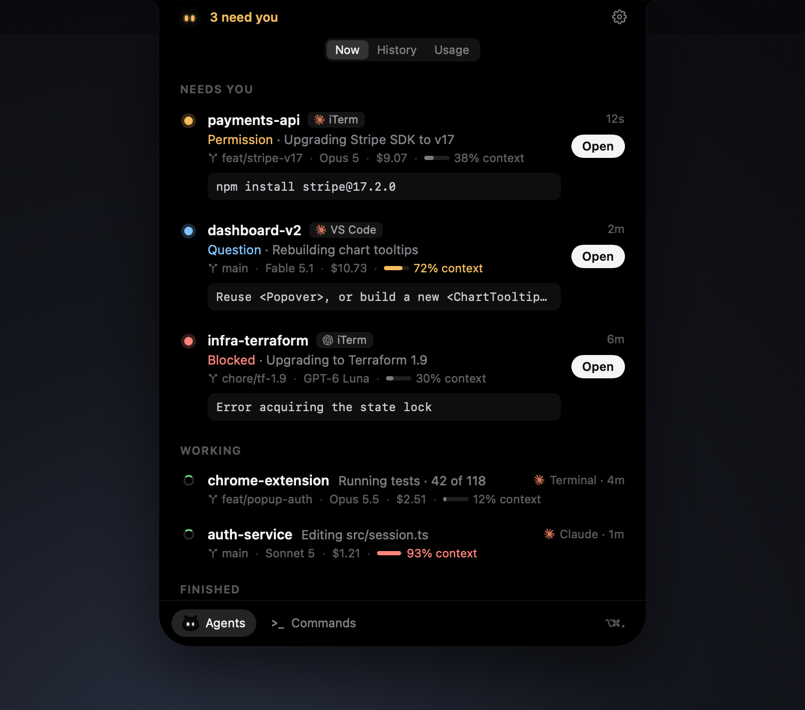
  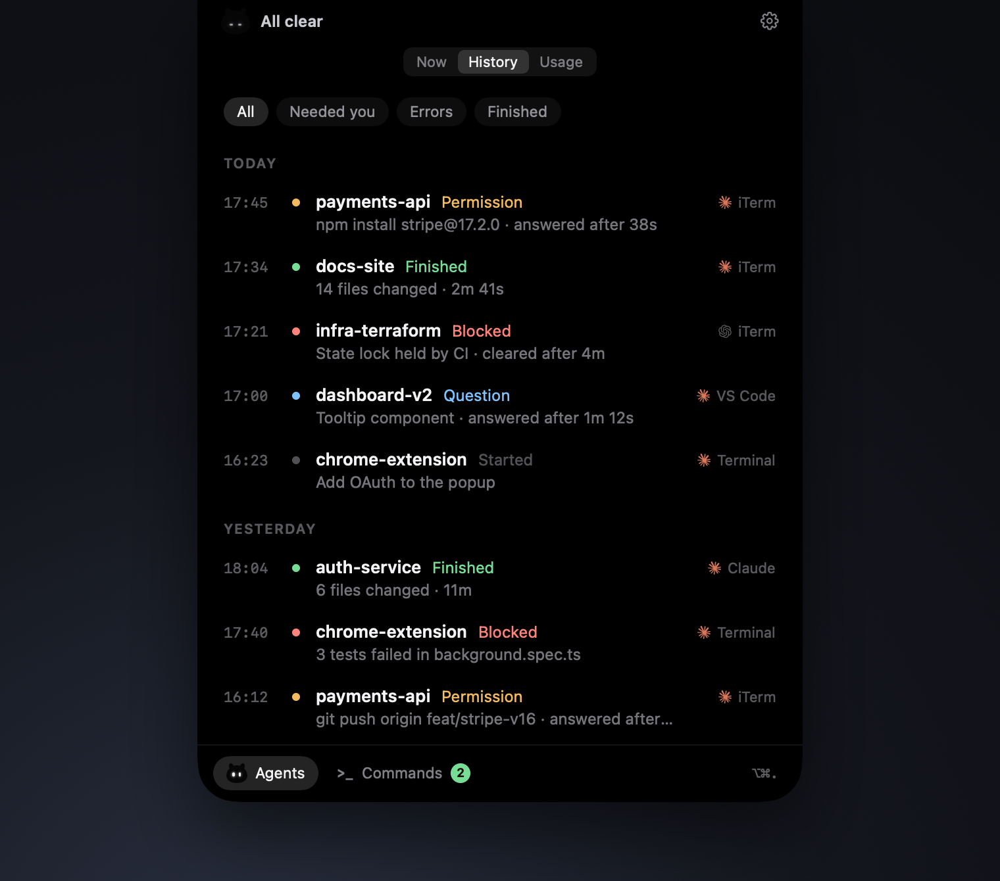
</p>

### Usage

Peeku asks Claude Code and Codex for your limits every few minutes, with no setup. Above each agent's limits, it adds up their session logs for **Today**, **7 days** or **30 days**: the cost at API prices, tokens (cache reads included), replies, the top model, and a bar per hour (today) or day, split by model. Hover a bar for its numbers. On a subscription, the dollars are what the same tokens would cost on the API, not what you pay. Add alerts (50–95% or a custom value) for Claude, Codex or both; each fires once per threshold until the limit resets.

<p align="center">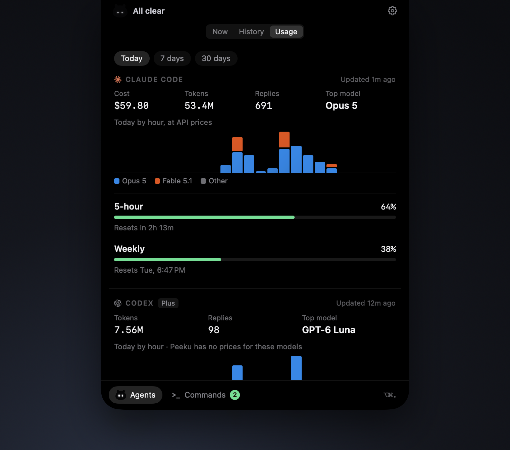</p>

<p align="center">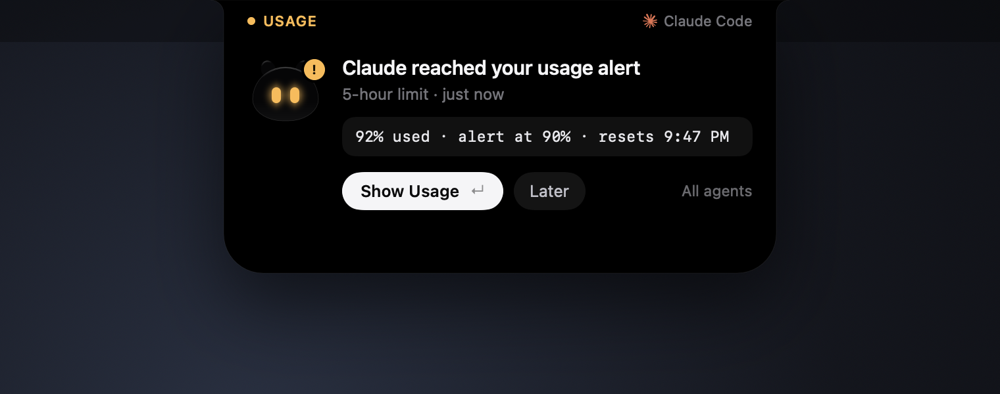</p>

### Commands

Commands keeps the commands you run all day, like a dev server, a worker or a docs preview. Add one with **+ New Command**: pick its folder and type the command. It runs in your login shell, like a new terminal tab, so nvm, pyenv and your aliases work. Each row shows whether it's running and its latest line of output. Hover a row to edit or delete it. Commands lives in the dock at the bottom of the session manager, not in the tabs at the top, and shows how many are running. Turn it off in Settings → Utilities if you don't need it.

<p align="center">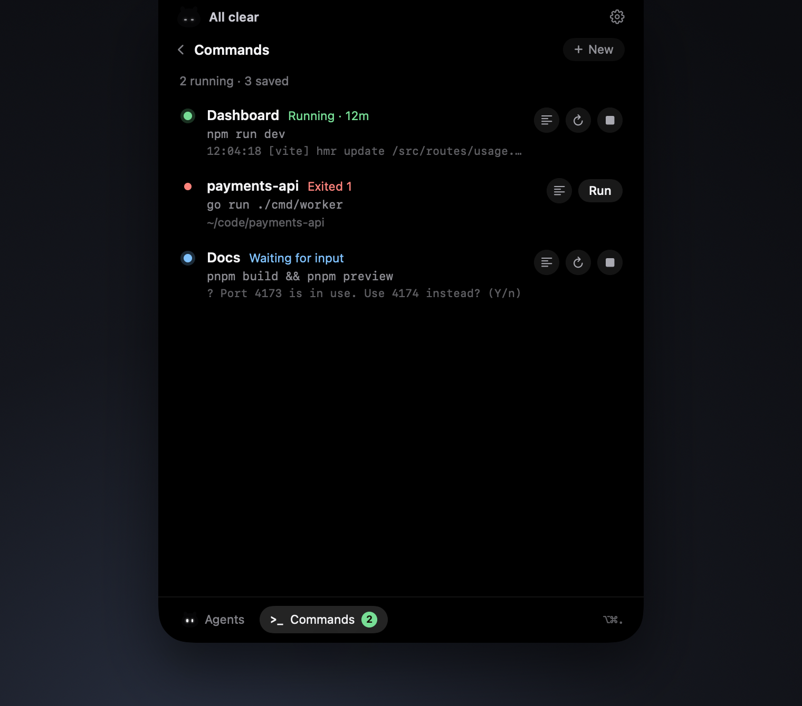</p>

When a command exits with an error, Peeku tells you with its last line of output. **Restart** runs it again, and **Show Output** opens everything it printed.

<p align="center">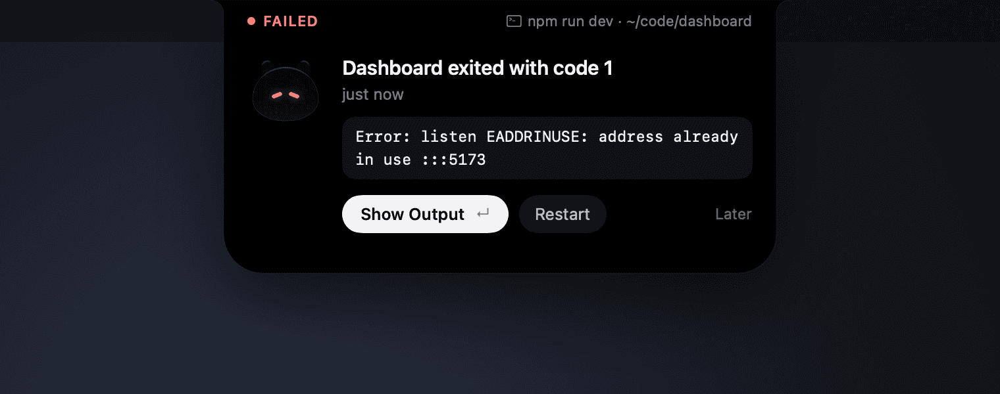</p>

Commands run in a real terminal, so tools can ask questions, like which port to use when theirs is taken. When a command asks and waits, Peeku drops out of the notch. Answer a yes/no question right there, or type any answer in the output window. Its buttons send Yes, No, Return and Ctrl-C.

<p align="center">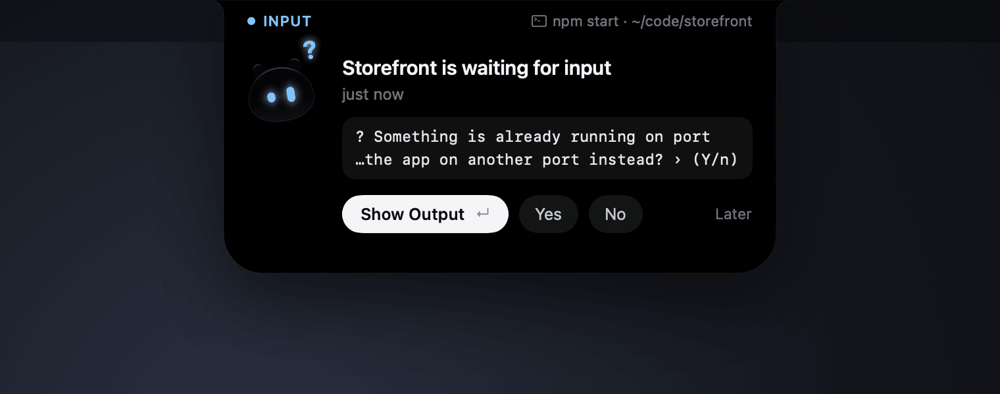</p>

<p align="center">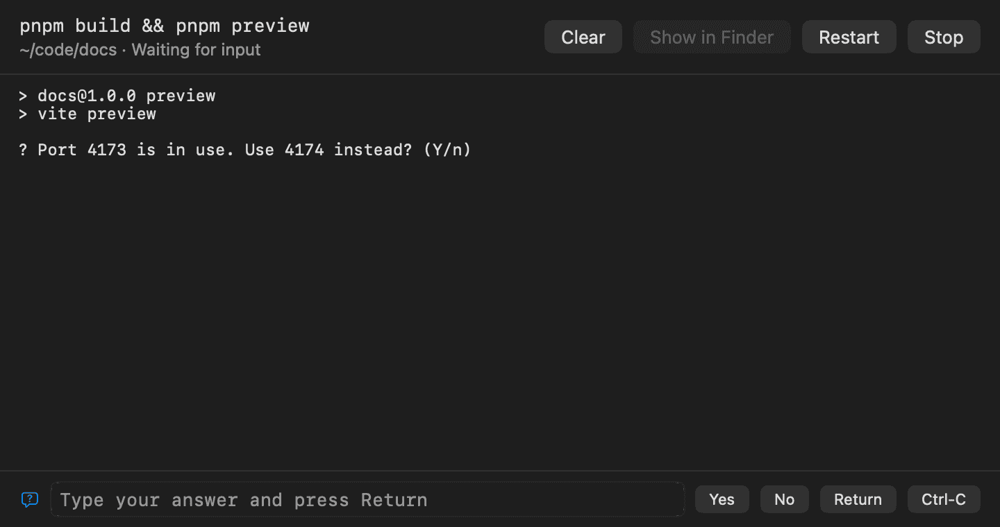</p>

Stopping a command stops everything it started, so a dev server doesn't keep its port. Quitting Peeku stops them all.

### Light mode

<p align="center">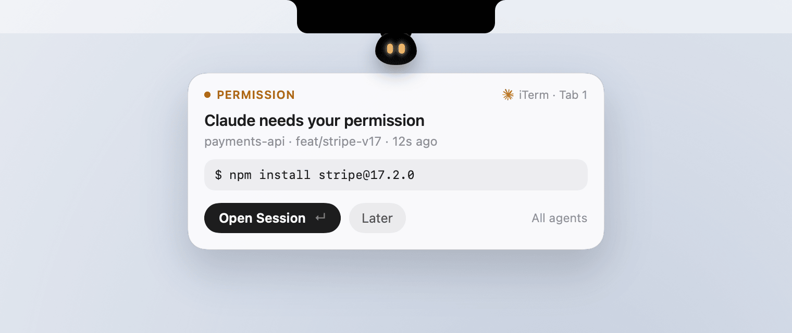</p>

### Peeku's moods

<p align="center">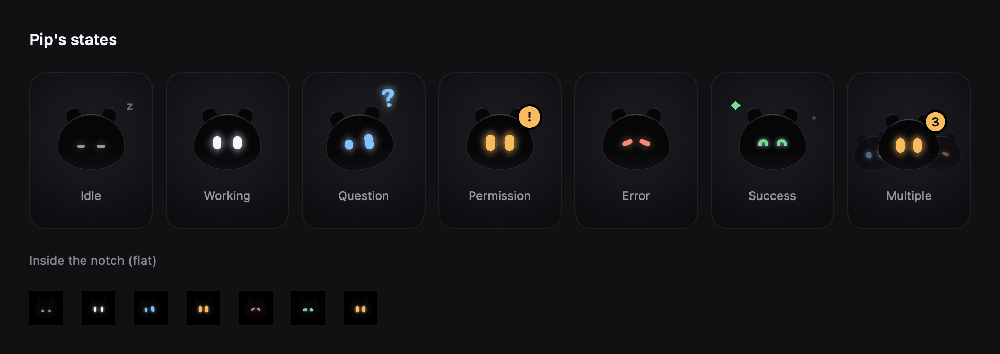</p>

## Install

1. Download **Peeku-x.y.z.zip** (not the `-update` one, which is for in-app updates) from the [latest release](https://github.com/ahrefabhi/peeku/releases/latest), unzip it, and move **Peeku.app** to Applications.
2. Open it (see below for the first launch).
3. Follow the setup, which connects Claude Code and, if you use it, Codex.

**Requires** macOS 14+ and [Claude Code](https://docs.anthropic.com/en/docs/claude-code) (any terminal, editor or the Claude app). [Codex CLI](https://developers.openai.com/codex/cli) is optional. Try it first with **Demo Mode** in the menu bar.

### The first time you open Peeku

Peeku isn't notarized yet, so macOS blocks the first launch:

<p align="center">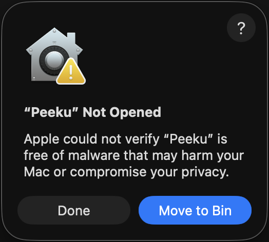</p>

Click **Done**, then either go to **System Settings → Privacy & Security** and click **Open Anyway**, or run:

```sh
xattr -dr com.apple.quarantine /Applications/Peeku.app
```

You only do this once; updates open normally.

<p align="center">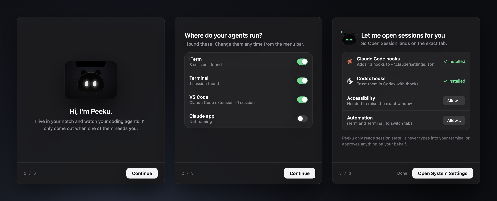</p>

## How it works

Everything runs on your Mac. The only network request Peeku makes itself is the update check.

- **Session list:** Claude Code's `~/.claude/sessions` says which sessions run and whether they're busy, idle or waiting.
- **Hooks:** setup adds hooks to `~/.claude/settings.json` (and `~/.codex/hooks.json`) that run `peeku-hook`. It records only what Peeku shows (command, question, error, summary, branch, app and tab), never transcripts, into `~/Library/Application Support/Peeku/inbox`, which Peeku deletes after reading. It never answers or blocks anything and exits immediately. For Codex, type `/hooks` and trust Peeku's entries.
- **Usage:** Peeku asks `claude -p` and `codex app-server` for rate limits using their own sign-ins; it never reads credentials. If that fails, **Set Up…** reads Claude's numbers from its status line instead, keeping any status line you have.
- **Spend:** Peeku reads the session logs in `~/.claude/projects` and `~/.codex/sessions` and keeps only each reply's time, model and token counts, priced from a table built into the app. Nothing else is kept, saved or sent.
- **Commands:** saved in `~/Library/Application Support/Peeku/commands.json`, with each command's latest output next to it. They run only when you press Run, in your login shell, with the same access as your terminal.
- **Permissions:** *Automation* selects the right iTerm or Terminal tab. *Accessibility* finds the exact window and detects screen sharing.

Your settings files are backed up before any change.

## Using Peeku

| Shortcut | Action |
|---|---|
| ⌥⌘. | Show or hide the session manager on your agents |
| ⌥⌘. then 1–3 | Open the manager on Now, History or Usage (keep ⌥⌘ held) |
| ⌥⌘, | Show or hide Commands |
| ⌥⌘↓ | Next waiting agent |
| ↵ | Open the highlighted session |
| Esc | Fold the alert into the pill, or go back to Agents from Commands or Settings |
| ⌘1–9 | Open a row by number |

↵, Esc and ⌘1–9 work once the notch has focus. Peeku never takes the keyboard on its own.

**Goes quiet** (count only, no pop-up or sound) while your screen is shared or recorded, when **Quiet** is on, or for the session you're already looking at. In full screen it shrinks to a glow along the top edge.

**Settings** opens from the gear at the top right of the session manager (or **Settings…** in the menu bar). It covers appearance, login, updates, sounds per state, usage alerts, showing costs, utilities, which apps to watch, hooks and permissions.

<p align="center">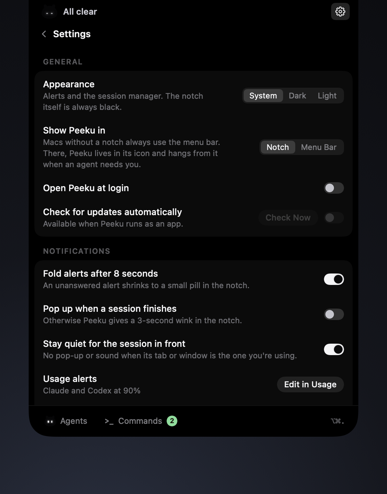</p>

## Updates and uninstall

Peeku updates itself through [Sparkle](https://sparkle-project.org), verifying each update's signature. Coming from Pip, the old name? Your data moves over automatically; allow the permissions once more.

To remove it, choose **Uninstall Peeku…** from the menu bar. It removes its hooks, restores your status line, deletes its data and moves itself to the Trash.

## Troubleshooting

- **"Peeku" Not Opened:** expected on first launch. See [The first time you open Peeku](#the-first-time-you-open-peeku).
- **A session shows but not why it's waiting:** install hooks from the menu bar, then restart that session.
- **No Codex sessions:** install Codex hooks, trust them with `/hooks`, and restart Codex.
- **No Claude usage:** the Usage tab says why. Update Claude Code, or choose **Set Up…** and run Claude Code in a terminal.
- **Opens the app but not the tab:** allow Peeku under Privacy & Security → Automation (iTerm, Terminal) or Accessibility (other apps).
- **Accessibility is on but Peeku asks again:** the permission belongs to an older build. Choose **Reset…** in Settings.
- **⌥⌘. does nothing:** another app uses it. Click the notch instead.
- **A command can't find `node`, `npm` or another tool:** Peeku runs commands in your login shell with your `.zshrc`, like a new terminal tab. Check that the command works in a new tab, or give the tool's full path.
- **A command's output has no colors:** expected. Commands see a plain terminal, so tools skip colors and spinners and the output stays readable.

## Building from source

Requires Xcode 26 (Swift 6.2).

```sh
git clone https://github.com/ahrefabhi/peeku.git && cd peeku
swift run Peeku                               # run (add --demo for Demo Mode)
scripts/bundle.sh && open build/Peeku.app     # build the app bundle
swift test                                    # unit tests
swift run Peeku --snapshot snapshots          # render every state to PNG
swift run Peeku --dump-sessions               # print the sessions Peeku sees
swift run Peeku --readme-images docs/images   # re-render README images
pngquant --quality=70-95 --strip --skip-if-larger --force --ext .png docs/images/*.png   # then shrink them (brew install pngquant)
PEEKU_HOME=/tmp/peeku swift run Peeku         # use a scratch data folder
```

| Path | What's there |
|---|---|
| `Sources/PeekuKit` | Model, queue, phase machine, session observation, hook installer, history, usage, quick commands. Unit-tested. |
| `Sources/PeekuHook` | `peeku-hook`, the collector hooks run. |
| `Sources/PeekuHookSchema` | The inbox record format. |
| `Sources/Peeku` | The app: notch, views, onboarding, settings, macOS integration. |
| `scripts` | Bundling, releasing, icon rendering. |

**Releasing:** `scripts/release.sh 0.2.0` does a dry run; add `--publish` to tag and upload. Sign with a stable certificate (`PEEKU_SIGN_IDENTITY` or one named **Peeku Code Signing**) so macOS permissions survive updates, and back up the Sparkle key (`generate_keys -x <file>`).

## Acknowledgements

Peeku started from a great idea: [Orbit](https://github.com/syedmazharaliraza/orbit), by [Syed Mazhar Ali Raza](https://github.com/syedmazharaliraza). Peeku wouldn't exist without it. Huge thanks to Syed for the inspiration and for building something so thoughtful. Go give Orbit a star.

Peeku works with [Claude Code](https://docs.anthropic.com/en/docs/claude-code) and [Codex](https://developers.openai.com/codex) but isn't affiliated with Anthropic or OpenAI.

## License

[MIT](LICENSE)
